# Diagrams

Every diagram of the system in one place, written as [Mermaid](https://mermaid.js.org) so it renders on GitHub and stays in version control next to the code. Each is derived from the implementation (rules, schemas, functions); when behaviour changes, update the diagram in the same change (see [CONTRIBUTING](CONTRIBUTING.md)).

Each diagram is also exported as a standalone SVG in [docs/diagrams](diagrams) for Word, slides or any viewer (regenerate with `node scripts/export-diagrams.cjs`). 39 diagrams: use cases, context, containers, components, ERD, class view, 8 state machines, 10 sequences, 8 backend diagrams, and process and delivery views.

**Contents**

1. [Requirements and context](#1-requirements-and-context): use cases, system context, containers
2. [Structure](#2-structure): web components, engineering engine, backend modules, data model (ERD), roles
3. [State machines](#3-state-machines): project, version, ticket, inspection, lead, payment, vote, approvals
4. [Sequences](#4-sequences): sign-up, invitations, inspection, maintenance, assistant, engineering, hand-off, map, reminders, privacy
5. [Backend](#5-backend): callable pipeline, authorization decisions, storage rules, AI pipeline, data flow, trust boundaries
6. [Process and delivery](#6-process-and-delivery): option search, sheet generation, CI/CD, test topology, deployment

---

## 1. Requirements and context

### 1.1 Use cases by actor

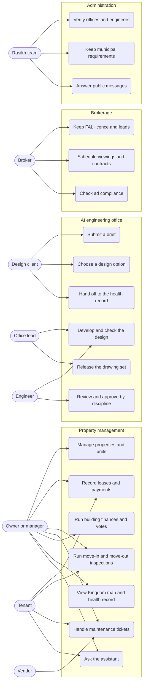
```mermaid
flowchart LR
  owner([Owner or manager])
  tenant([Tenant])
  vendor([Vendor])
  broker([Broker])
  client([Design client])
  lead([Office lead])
  eng([Engineer])
  team([Rasikh team])

  subgraph PM[Property management]
    p1(Manage properties and units)
    p2(Record leases and payments)
    p3(Run move-in and move-out inspections)
    p4(Handle maintenance tickets)
    p5(Run building finances and votes)
    p6(View Kingdom map and health record)
    p7(Ask the assistant)
  end
  subgraph ENG[AI engineering office]
    e1(Submit a brief)
    e2(Choose a design option)
    e3(Develop and check the design)
    e4(Review and approve by discipline)
    e5(Release the drawing set)
    e6(Hand off to the health record)
  end
  subgraph BRK[Brokerage]
    b1(Keep FAL licence and leads)
    b2(Schedule viewings and contracts)
    b3(Check ad compliance)
  end
  subgraph ADM[Administration]
    a1(Verify offices and engineers)
    a2(Keep municipal requirements)
    a3(Answer public messages)
  end

  owner --> p1 & p2 & p3 & p4 & p5 & p6 & p7
  tenant --> p2 & p3 & p4 & p7
  vendor --> p4
  broker --> b1 & b2 & b3
  client --> e1 & e2 & e6
  lead --> e3 & e5
  eng --> e3 & e4
  team --> a1 & a2 & a3
```

### 1.2 System context

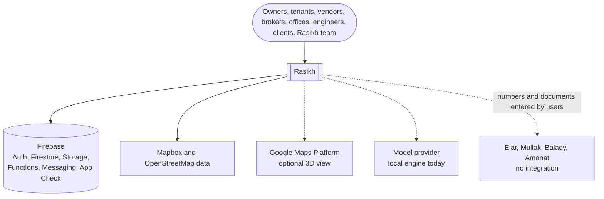
```mermaid
flowchart TB
  users([Owners, tenants, vendors, brokers, offices, engineers, clients, Rasikh team])
  rasikh[[Rasikh]]
  firebase[(Firebase<br/>Auth, Firestore, Storage,<br/>Functions, Messaging, App Check)]
  mapbox[Mapbox and OpenStreetMap data]
  google[Google Maps Platform<br/>optional 3D view]
  model[Model provider<br/>local engine today]
  gov[Ejar, Mullak, Balady, Amanat<br/>no integration]

  users --> rasikh
  rasikh --> firebase
  rasikh --> mapbox
  rasikh -.-> google
  rasikh -.-> model
  rasikh -. numbers and documents entered by users .-> gov
```

### 1.3 Containers

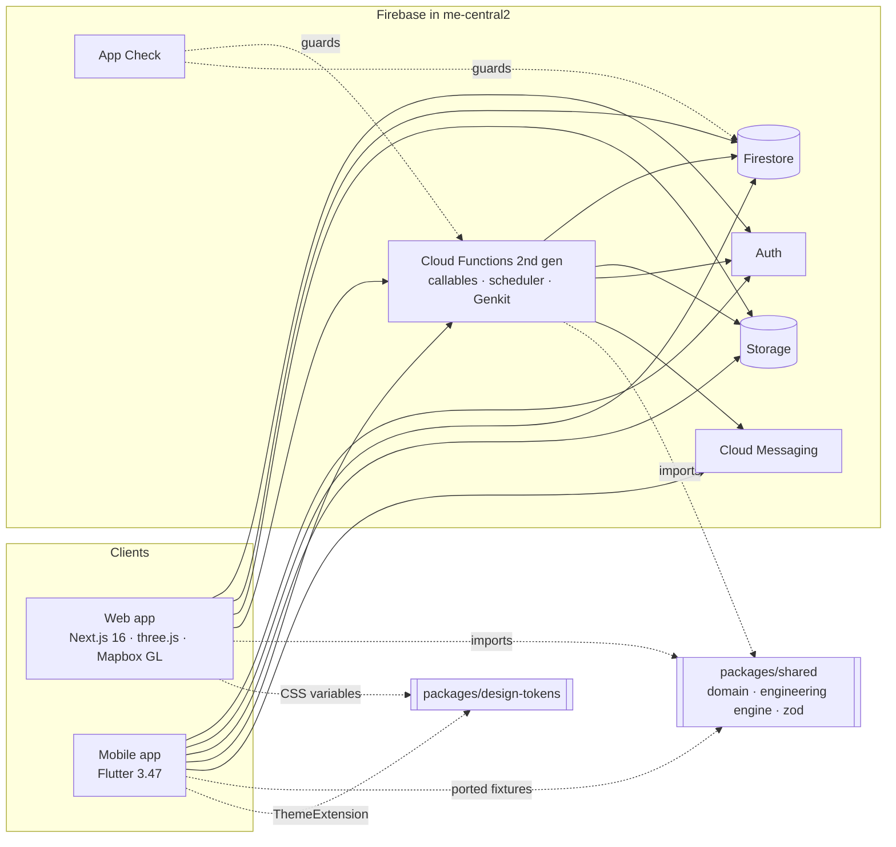
```mermaid
flowchart LR
  subgraph clients[Clients]
    web[Web app<br/>Next.js 16 · three.js · Mapbox GL]
    app[Mobile app<br/>Flutter 3.47]
  end
  subgraph fb[Firebase in me-central2]
    auth[Auth]
    fs[(Firestore)]
    st[(Storage)]
    fn[Cloud Functions 2nd gen<br/>callables · scheduler · Genkit]
    fcm[Cloud Messaging]
    ac[App Check]
  end
  shared[[packages/shared<br/>domain · engineering engine · zod]]
  tokens[[packages/design-tokens]]

  web --> auth & fs & st & fn
  app --> auth & fs & st & fn & fcm
  fn --> fs & st & auth & fcm
  ac -.guards.-> fn
  ac -.guards.-> fs
  web -. imports .-> shared
  fn -. imports .-> shared
  app -. ported fixtures .-> shared
  web -. CSS variables .-> tokens
  app -. ThemeExtension .-> tokens
```

---

## 2. Structure

### 2.1 Web application components

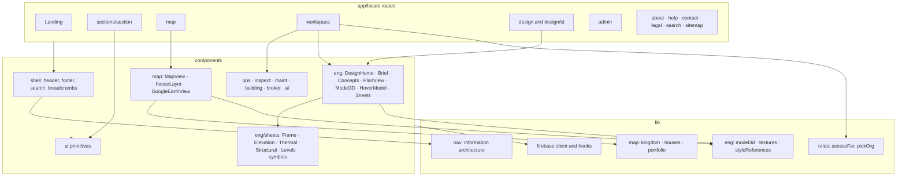
```mermaid
flowchart TB
  subgraph routes[app/locale routes]
    landing[Landing]
    sections[sections/section]
    map[map]
    workspace[workspace]
    design[design and design/id]
    admin[admin]
    legal[about · help · contact · legal · search · sitemap]
  end
  subgraph comps[components]
    shell[shell: header, footer, search, breadcrumbs]
    ops[ops · inspect · maint · building · broker · ai]
    eng[eng: DesignHome · Brief · Concepts · PlanView · Model3D · HoverModel · Sheets]
    sheets[eng/sheets: Frame · Elevation · Thermal · Structural · Levels · symbols]
    mapc[map: MapView · houseLayer · GoogleEarthView]
    ui[ui primitives]
  end
  subgraph lib[lib]
    fire[firebase client and hooks]
    roles[roles: accessFor, pickOrg]
    nav[nav: information architecture]
    engl[eng: model3d · textures · styleReferences]
    mapl[map: kingdom · houses · portfolio]
  end
  routes --> shell
  workspace --> ops & eng
  design --> eng
  sections --> ui
  map --> mapc
  eng --> sheets
  eng --> engl
  mapc --> mapl
  mapc --> engl
  comps --> ui
  comps --> fire
  workspace --> roles
  shell --> nav
```

### 2.2 Engineering engine modules (packages/shared)

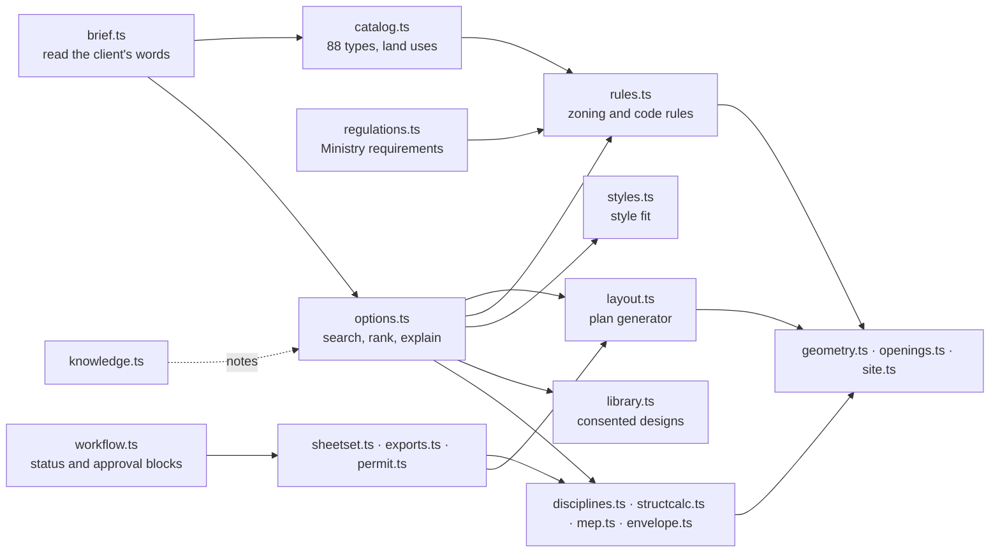
```mermaid
flowchart LR
  brief[brief.ts<br/>read the client's words]
  catalog[catalog.ts<br/>88 types, land uses]
  regs[regulations.ts<br/>Ministry requirements]
  layout[layout.ts<br/>plan generator]
  geo[geometry.ts · openings.ts · site.ts]
  rules[rules.ts<br/>zoning and code rules]
  styles[styles.ts<br/>style fit]
  lib[library.ts<br/>consented designs]
  options[options.ts<br/>search, rank, explain]
  disc[disciplines.ts · structcalc.ts · mep.ts · envelope.ts]
  sheets[sheetset.ts · exports.ts · permit.ts]
  flow[workflow.ts<br/>status and approval blocks]
  know[knowledge.ts]

  brief --> catalog
  brief --> options
  regs --> rules
  catalog --> rules
  layout --> geo
  options --> layout
  options --> rules
  options --> styles
  options --> lib
  options --> disc
  rules --> geo
  disc --> geo
  sheets --> disc
  sheets --> layout
  flow --> sheets
  know -. notes .-> options
```

### 2.3 Backend modules (Cloud Functions)

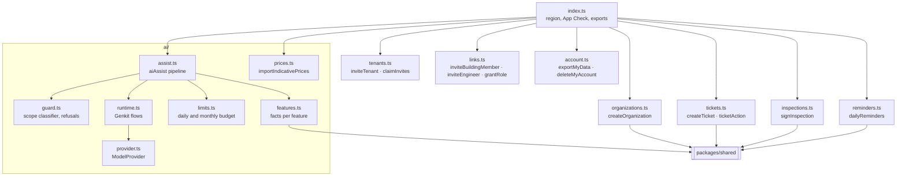
```mermaid
flowchart TB
  index[index.ts<br/>region, App Check, exports]
  org[organizations.ts<br/>createOrganization]
  ten[tenants.ts<br/>inviteTenant · claimInvites]
  links[links.ts<br/>inviteBuildingMember · inviteEngineer · grantRole]
  insp[inspections.ts<br/>signInspection]
  tick[tickets.ts<br/>createTicket · ticketAction]
  acct[account.ts<br/>exportMyData · deleteMyAccount]
  rem[reminders.ts<br/>dailyReminders]
  subgraph ai[ai/]
    assist[assist.ts<br/>aiAssist pipeline]
    guard[guard.ts<br/>scope classifier, refusals]
    feat[features.ts<br/>facts per feature]
    lim[limits.ts<br/>daily and monthly budget]
    runtime[runtime.ts<br/>Genkit flows]
    prov[provider.ts<br/>ModelProvider]
    prices[prices.ts<br/>importIndicativePrices]
  end
  shared[[packages/shared]]

  index --> org & ten & links & insp & tick & acct & rem & assist & prices
  assist --> guard & feat & lim & runtime
  runtime --> prov
  feat --> shared
  org --> shared
  tick --> shared
  insp --> shared
  rem --> shared
```

### 2.4 Data model (entity relationships)

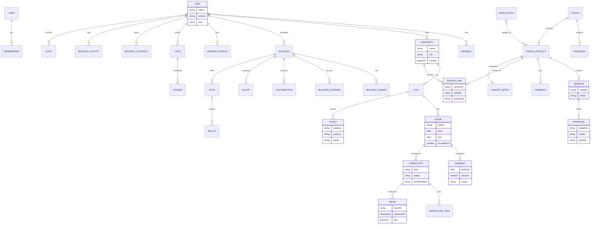
```mermaid
erDiagram
  USER ||--o{ MEMBERSHIP : has
  ORG ||--o{ MEMBER : has
  ORG ||--o{ PROPERTY : owns
  PROPERTY ||--o{ UNIT : has
  UNIT ||--o{ LEASE : has
  LEASE ||--o{ PAYMENT : schedules
  LEASE ||--o{ INSPECTION : documents
  INSPECTION ||--o{ INSPECTION_ITEM : has
  INSPECTION ||--o{ MEDIA : evidences
  UNIT ||--o{ TICKET : reports
  ORG ||--o{ BUILDING : manages
  BUILDING ||--o{ BUILDING_OWNER : has
  BUILDING ||--o{ BUILDING_EXPENSE : records
  BUILDING ||--o{ CONTRIBUTION : receives
  BUILDING ||--o{ QUOTE : compares
  BUILDING ||--o{ VOTE : holds
  VOTE ||--o{ BALLOT : collects
  ORG ||--o{ BROKER_PROFILE : has
  ORG ||--o{ LEAD : tracks
  LEAD ||--o{ VIEWING : schedules
  ORG ||--o{ BROKER_CONTRACT : signs
  ORG ||--o{ BROKER_ACTIVITY : logs
  ORG ||--o{ AUDIT : records
  OFFICE ||--o{ ENGINEER : employs
  OFFICE ||--o{ DESIGN_PROJECT : receives
  DESIGN_PROJECT ||--o{ VERSION : contains
  VERSION ||--o{ APPROVAL : needs
  DESIGN_PROJECT ||--o{ COMMENT : has
  DESIGN_PROJECT ||--o| DESIGN_LINK : hands_off
  PROPERTY ||--o{ DESIGN_LINK : records
  DESIGN_PROJECT ||--o| LIBRARY_ENTRY : contributes
  REGULATION }o--o{ DESIGN_PROJECT : applies_to

  ORG { string name string section string plan }
  PROPERTY { string name string city geopoint location }
  LEASE { string ejarNo date start date end number annualRent }
  PAYMENT { date dueDate number amount string status }
  INSPECTION { string kind string status string sealedDigest }
  MEDIA { string sha256 timestamp capturedAt geopoint gps }
  TICKET { string category string urgency string status }
  VERSION { string sha256 string status }
  APPROVAL { string discipline string sceNo string sha256 }
  DESIGN_LINK { string versionId string sha256 string propertyId }
```

### 2.5 Roles and sections

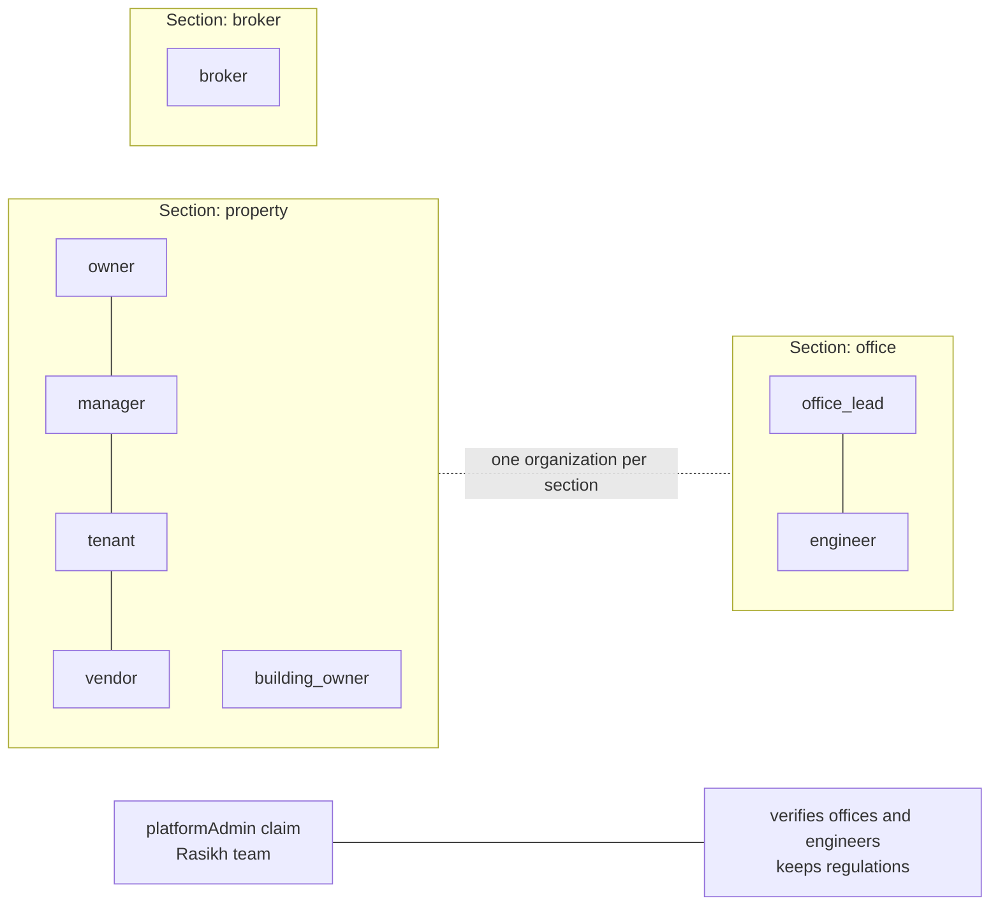
```mermaid
flowchart LR
  subgraph property[Section: property]
    owner[owner] --- manager[manager] --- tenant[tenant] --- vendor[vendor]
    bo[building_owner]
  end
  subgraph office[Section: office]
    lead[office_lead] --- engineer[engineer]
  end
  subgraph brokerage[Section: broker]
    broker[broker]
  end
  admin[platformAdmin claim<br/>Rasikh team]
  property -. one organization per section .- office
  admin --- verify[verifies offices and engineers<br/>keeps regulations]
```

### 2.6 Class view of the key interfaces

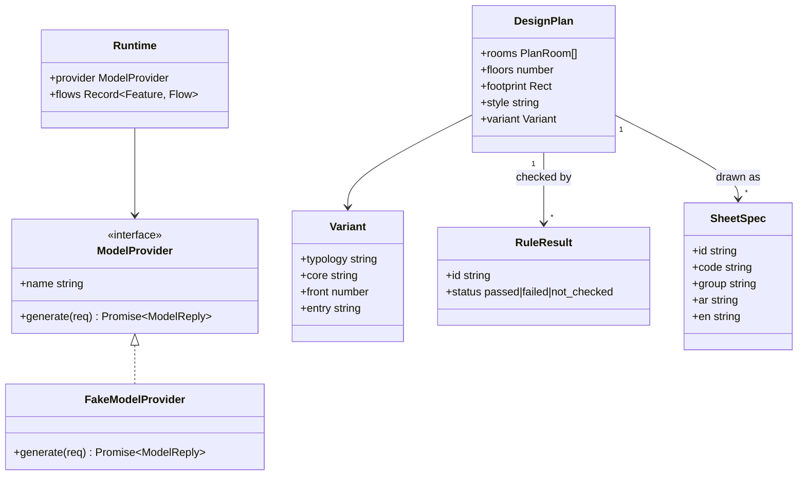
```mermaid
classDiagram
  class ModelProvider {
    <<interface>>
    +name string
    +generate(req) Promise~ModelReply~
  }
  class FakeModelProvider {
    +generate(req) Promise~ModelReply~
  }
  class Runtime {
    +provider ModelProvider
    +flows Record~Feature, Flow~
  }
  class DesignPlan {
    +rooms PlanRoom[]
    +floors number
    +footprint Rect
    +style string
    +variant Variant
  }
  class Variant {
    +typology string
    +core string
    +front number
    +entry string
  }
  class RuleResult {
    +id string
    +status passed|failed|not_checked
  }
  class SheetSpec {
    +id string
    +code string
    +group string
    +ar string
    +en string
  }
  ModelProvider <|.. FakeModelProvider
  Runtime --> ModelProvider
  DesignPlan --> Variant
  DesignPlan "1" --> "*" RuleResult : checked by
  DesignPlan "1" --> "*" SheetSpec : drawn as
```

---

## 3. State machines

### 3.1 Engineering project

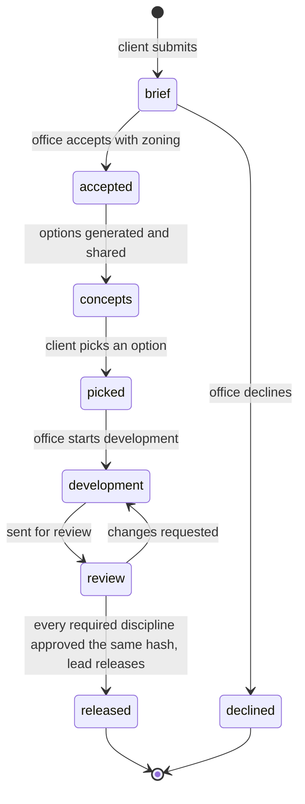
```mermaid
stateDiagram-v2
  [*] --> brief: client submits
  brief --> accepted: office accepts with zoning
  brief --> declined: office declines
  accepted --> concepts: options generated and shared
  concepts --> picked: client picks an option
  picked --> development: office starts development
  development --> review: sent for review
  review --> development: changes requested
  review --> released: every required discipline approved the same hash, lead releases
  released --> [*]
  declined --> [*]
```

### 3.2 Design version and approval gate

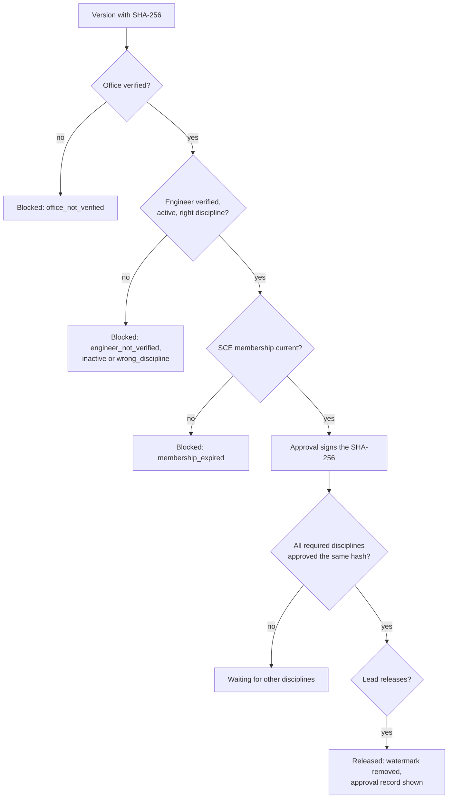
```mermaid
flowchart TD
  v[Version with SHA-256] --> ov{Office verified?}
  ov -- no --> blocked1[Blocked: office_not_verified]
  ov -- yes --> eng{Engineer verified,<br/>active, right discipline?}
  eng -- no --> blocked2[Blocked: engineer_not_verified,<br/>inactive or wrong_discipline]
  eng -- yes --> exp{SCE membership current?}
  exp -- no --> blocked3[Blocked: membership_expired]
  exp -- yes --> appr[Approval signs the SHA-256]
  appr --> all{All required disciplines<br/>approved the same hash?}
  all -- no --> wait[Waiting for other disciplines]
  all -- yes --> lead{Lead releases?}
  lead -- yes --> rel[Released: watermark removed,<br/>approval record shown]
```

### 3.3 Maintenance ticket

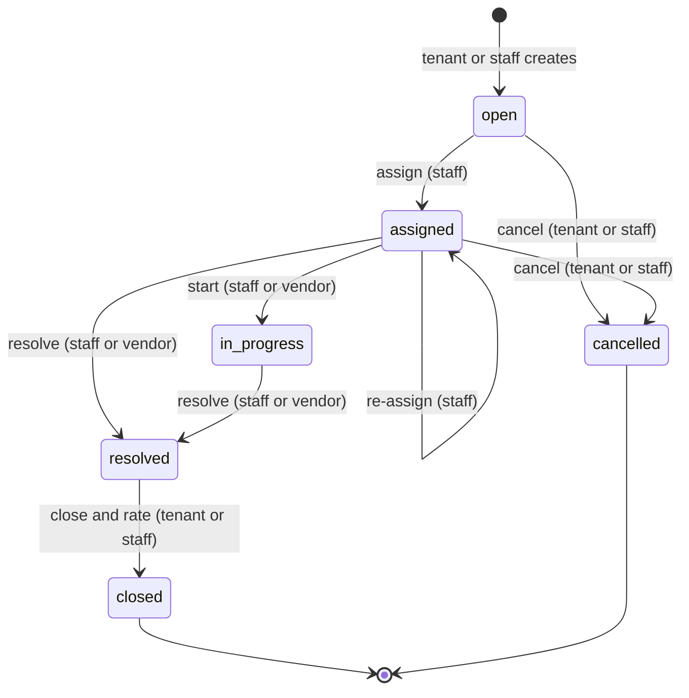
```mermaid
stateDiagram-v2
  [*] --> open: tenant or staff creates
  open --> assigned: assign (staff)
  assigned --> assigned: re-assign (staff)
  assigned --> in_progress: start (staff or vendor)
  assigned --> resolved: resolve (staff or vendor)
  in_progress --> resolved: resolve (staff or vendor)
  resolved --> closed: close and rate (tenant or staff)
  open --> cancelled: cancel (tenant or staff)
  assigned --> cancelled: cancel (tenant or staff)
  closed --> [*]
  cancelled --> [*]
```

### 3.4 Inspection

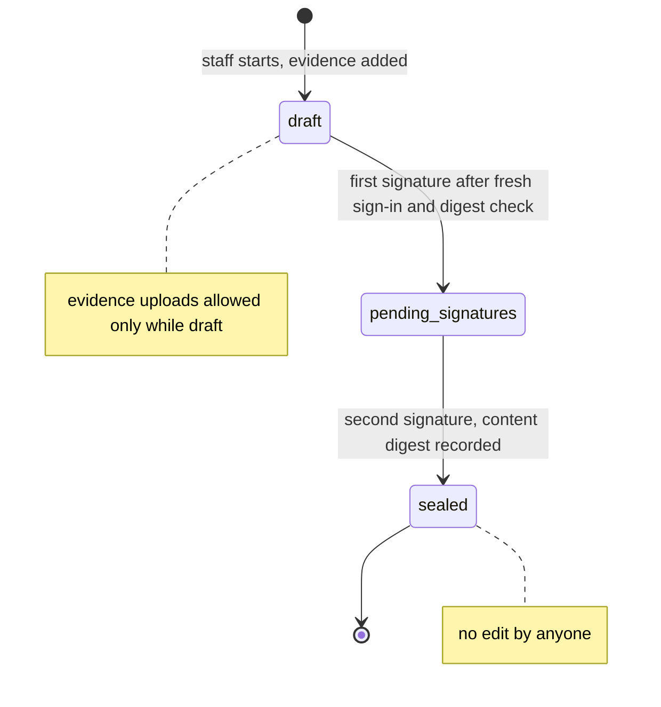
```mermaid
stateDiagram-v2
  [*] --> draft: staff starts, evidence added
  draft --> pending_signatures: first signature after fresh sign-in and digest check
  pending_signatures --> sealed: second signature, content digest recorded
  sealed --> [*]
  note right of draft: evidence uploads allowed only while draft
  note right of sealed: no edit by anyone
```

### 3.5 Lead funnel (forward only)

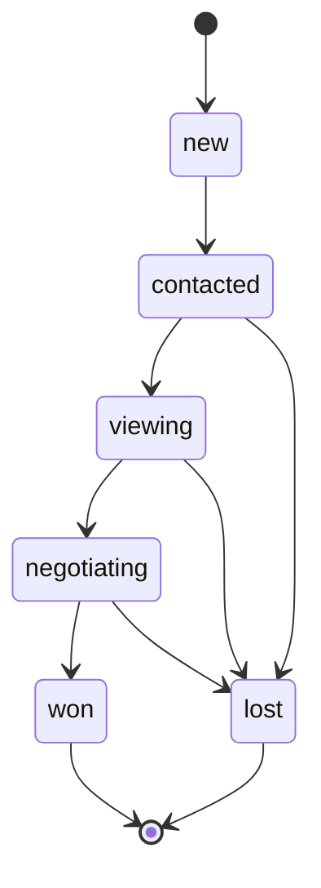
```mermaid
stateDiagram-v2
  [*] --> new
  new --> contacted
  contacted --> viewing
  viewing --> negotiating
  negotiating --> won
  negotiating --> lost
  viewing --> lost
  contacted --> lost
  won --> [*]
  lost --> [*]
```

### 3.6 Payment and vote

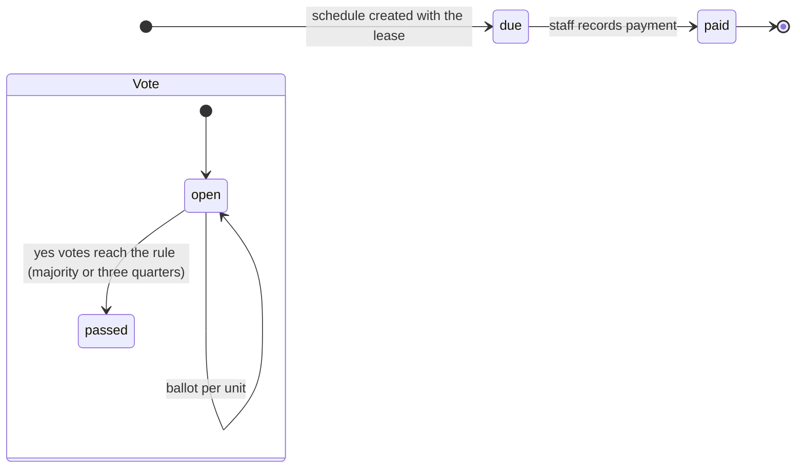
```mermaid
stateDiagram-v2
  direction LR
  [*] --> due: schedule created with the lease
  due --> paid: staff records payment
  paid --> [*]
  state "Vote" as V {
    [*] --> open
    open --> passed: yes votes reach the rule (majority or three quarters)
    open --> open: ballot per unit
  }
```

### 3.7 Account and organization

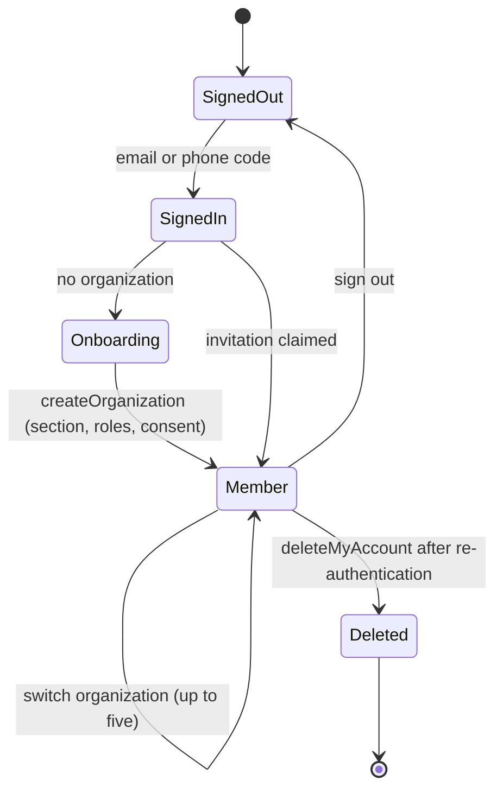
```mermaid
stateDiagram-v2
  [*] --> SignedOut
  SignedOut --> SignedIn: email or phone code
  SignedIn --> Onboarding: no organization
  Onboarding --> Member: createOrganization (section, roles, consent)
  SignedIn --> Member: invitation claimed
  Member --> Member: switch organization (up to five)
  Member --> SignedOut: sign out
  Member --> Deleted: deleteMyAccount after re-authentication
  Deleted --> [*]
```

---

## 4. Sequences

### 4.1 Sign-up, section choice and onboarding

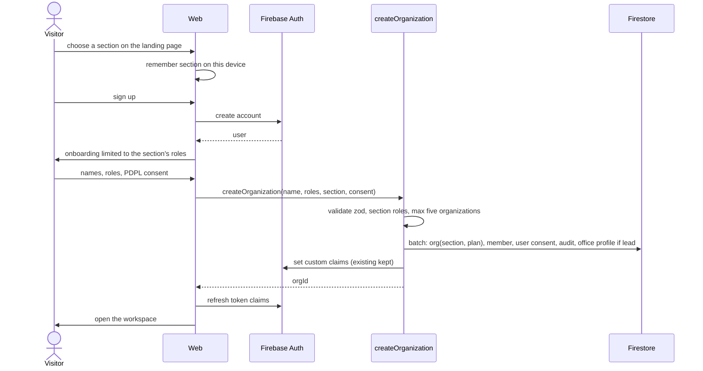
```mermaid
sequenceDiagram
  actor U as Visitor
  participant W as Web
  participant A as Firebase Auth
  participant F as createOrganization
  participant D as Firestore
  U->>W: choose a section on the landing page
  W->>W: remember section on this device
  U->>W: sign up
  W->>A: create account
  A-->>W: user
  W->>U: onboarding limited to the section's roles
  U->>W: names, roles, PDPL consent
  W->>F: createOrganization(name, roles, section, consent)
  F->>F: validate zod, section roles, max five organizations
  F->>D: batch: org(section, plan), member, user consent, audit, office profile if lead
  F->>A: set custom claims (existing kept)
  F-->>W: orgId
  W->>A: refresh token claims
  W->>U: open the workspace
```

### 4.2 Tenant invitation

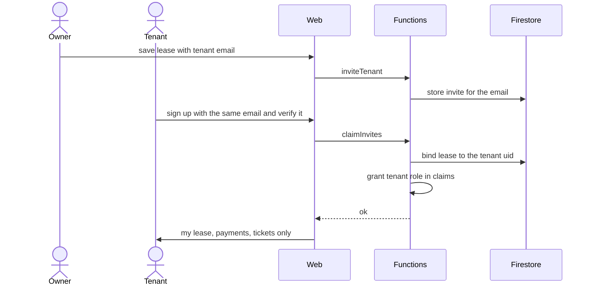
```mermaid
sequenceDiagram
  actor O as Owner
  actor T as Tenant
  participant W as Web
  participant F as Functions
  participant D as Firestore
  O->>W: save lease with tenant email
  W->>F: inviteTenant
  F->>D: store invite for the email
  T->>W: sign up with the same email and verify it
  W->>F: claimInvites
  F->>D: bind lease to the tenant uid
  F->>F: grant tenant role in claims
  F-->>W: ok
  W->>T: my lease, payments, tickets only
```

### 4.3 Inspection: capture, verify and seal

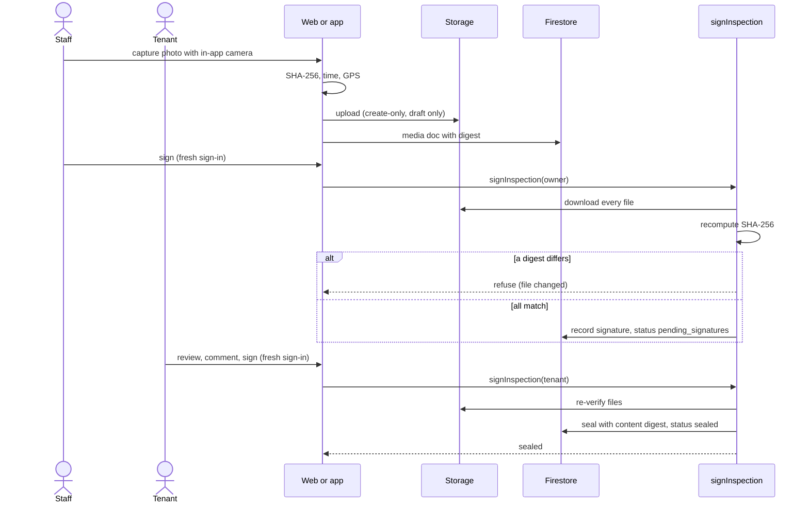
```mermaid
sequenceDiagram
  actor S as Staff
  actor T as Tenant
  participant W as Web or app
  participant St as Storage
  participant D as Firestore
  participant F as signInspection
  S->>W: capture photo with in-app camera
  W->>W: SHA-256, time, GPS
  W->>St: upload (create-only, draft only)
  W->>D: media doc with digest
  S->>W: sign (fresh sign-in)
  W->>F: signInspection(owner)
  F->>St: download every file
  F->>F: recompute SHA-256
  alt a digest differs
    F-->>W: refuse (file changed)
  else all match
    F->>D: record signature, status pending_signatures
  end
  T->>W: review, comment, sign (fresh sign-in)
  W->>F: signInspection(tenant)
  F->>St: re-verify files
  F->>D: seal with content digest, status sealed
  F-->>W: sealed
```

### 4.4 Maintenance

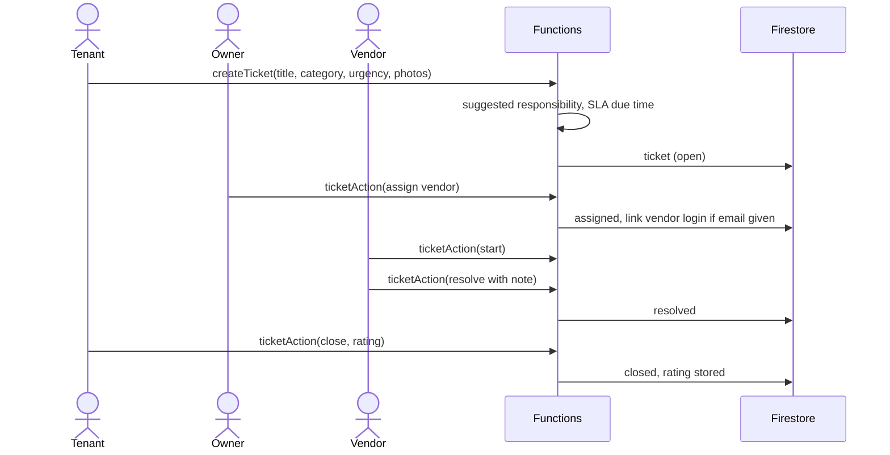
```mermaid
sequenceDiagram
  actor T as Tenant
  actor O as Owner
  actor V as Vendor
  participant F as Functions
  participant D as Firestore
  T->>F: createTicket(title, category, urgency, photos)
  F->>F: suggested responsibility, SLA due time
  F->>D: ticket (open)
  O->>F: ticketAction(assign vendor)
  F->>D: assigned, link vendor login if email given
  V->>F: ticketAction(start)
  V->>F: ticketAction(resolve with note)
  F->>D: resolved
  T->>F: ticketAction(close, rating)
  F->>D: closed, rating stored
```

### 4.5 Assistant request

```mermaid
sequenceDiagram
  actor U as User
  participant W as Web
  participant F as aiAssist
  participant G as Scope guard
  participant Fa as Facts and knowledge
  participant L as Limits
  participant R as Genkit flow
  participant P as ModelProvider
  U->>W: question
  W->>F: aiAssist(orgId, feature, input)
  F->>F: sign-in, membership, zod
  F->>G: classify scope
  alt off topic or jailbreak
    G-->>F: refuse
    F-->>W: polite Arabic refusal
  else in scope
    F->>Fa: gather facts with the caller's permissions, match knowledge
    F->>L: reserve daily and monthly budget (transaction)
    alt limit reached
      L-->>F: daily_limit or monthly_cap
    else reserved
      F->>R: facts, question
      R->>P: generate
      P-->>R: text
      F->>F: log metadata only
      F-->>W: marked AI output, citations, disclaimers
    end
  end
  U->>W: tap to apply a suggestion (only then a record changes)
```

### 4.6 Engineering: from brief to release

```mermaid
sequenceDiagram
  actor C as Client
  actor O as Office lead
  actor E as Engineers
  participant W as Web (engine in browser)
  participant D as Firestore
  C->>W: describe the house
  W->>W: parseBrief, read back programme
  C->>D: brief (project)
  O->>W: apply Ministry requirements, confirm height, accept
  O->>W: generate options
  W->>W: search variants, rules, BOQ, style fit
  W->>D: versions with checks and BOQ
  O->>D: share options
  C->>D: pick option
  O->>W: develop, edit rooms (checks re-run)
  O->>D: send for review
  loop each required discipline
    E->>D: approve (SHA-256 of the version)
  end
  O->>D: release (rules check same hash for all)
  D-->>C: released set, approval record, no watermark
```

### 4.7 Hand-off to the Property Health Record

```mermaid
sequenceDiagram
  actor C as Client
  participant W as Web
  participant D as Firestore
  C->>W: open released project
  W->>D: read handoff status
  C->>W: add to property record (choose property)
  W->>D: create orgs/org/designs/project (released set, SHA-256, property)
  D-->>D: rules: only the commissioner, released set, existing property
  W->>D: timeline reads the link
  W->>C: design_released event in the record
  Note over W,D: the map now stands this exact design on the property pin
```

### 4.8 Map: a property standing on its pin

```mermaid
sequenceDiagram
  participant M as MyPortfolio
  participant D as Firestore
  participant V as MapView
  participant H as houses.ts
  participant L as houseLayer
  M->>D: properties, units, leases, payments, design links
  M->>D: released plan of each linked design
  M->>V: items (coordinates, units, optional plan)
  V->>H: houseFor(property)
  alt released design exists
    H-->>V: that plan (real)
  else none
    H-->>V: plausible villa or apartment block (approximate)
  end
  V->>L: setProperties
  L->>L: buildModel realistic, place in Mercator space at true scale
  L-->>V: custom layer renders above the basemap buildings
```

### 4.9 Daily reminders

```mermaid
sequenceDiagram
  participant S as Scheduler 07:00 Riyadh
  participant F as dailyReminders
  participant D as Firestore
  participant M as Cloud Messaging
  S->>F: trigger
  F->>D: leases and payments per organization
  F->>F: compute late, upcoming, expiring, renewal notice (60 days)
  F->>D: write notifications (idempotent per day)
  F->>M: push to the person's devices
```

### 4.10 Export and delete my data

```mermaid
sequenceDiagram
  actor U as User
  participant W as Web
  participant F as account functions
  participant D as Firestore
  participant A as Auth
  U->>W: export my data
  W->>F: exportMyData
  F->>D: collect the user's data
  F-->>W: file
  U->>W: delete my account (re-authenticate)
  W->>F: deleteMyAccount
  F->>D: remove or anonymize user data and memberships
  F->>A: delete the auth user
  F-->>W: done
```

---

## 5. Backend

### 5.1 Callable request pipeline

```mermaid
flowchart TD
  req[Client calls a callable] --> ac{App Check valid?<br/>enforced in production}
  ac -- no --> r1[Reject]
  ac -- yes --> au{Signed in?}
  au -- no --> r2[unauthenticated: auth_required]
  au -- yes --> val{zod validation passes?}
  val -- no --> r3[invalid-argument: invalid_input]
  val -- yes --> authz{Membership and role allow it?}
  authz -- no --> r4[permission-denied: not_allowed]
  authz -- yes --> lim{Limits ok, AI only}
  lim -- no --> r5[resource-exhausted]
  lim -- yes --> work[Do the work with the Admin SDK<br/>transaction or batch]
  work --> audit[Write audit entry for sensitive actions]
  audit --> res[Return result]
```

### 5.2 Firestore authorization decision

```mermaid
flowchart TD
  a[Client read or write] --> s{request.auth present?}
  s -- no --> deny[Deny]
  s -- yes --> m{Member of the organization<br/>per custom claims?}
  m -- no --> deny
  m -- yes --> role{Role allowed for this collection and action?}
  role -- no --> deny
  role -- yes --> own{Ownership or relation needed?<br/>tenant uid, vendor uid, unit owner, project client}
  own -- not met --> deny
  own -- met or n/a --> shape{Document shape and immutability ok?<br/>write-once, append-only, sealed, released}
  shape -- no --> deny
  shape -- yes --> allow[Allow]
```

### 5.3 Engineering project visibility

```mermaid
flowchart LR
  proj[(designProjects/pid)]
  proj --> ver[versions]
  proj --> app[approvals]
  proj --> com[comments]
  office[Office members] -->|read and write per role| proj
  office -->|all versions| ver
  client[Design client] -->|own project| proj
  client -->|shared and released only| ver
  client -->|released only| app
  other[Another office or user] -. denied .-> proj
```

### 5.4 Storage rules by area

```mermaid
flowchart TD
  f[Storage request] --> p{Path}
  p -- orgs/org/receipts --> r[Read: member<br/>Create once: allowed roles, image video or pdf, under 25 MB]
  p -- orgs/org/inspections/id --> i[Read: staff or that lease's tenant<br/>Create once: staff, image or video, inspection status draft]
  p -- orgs/org/tickets/id --> t[Read: staff, tenant or vendor of the ticket<br/>Create once: owner, tenant, manager, admin, image]
  p -- anything else --> x[Deny]
  r & i & t --> nu[Update and delete: always denied]
```

### 5.5 AI pipeline

```mermaid
flowchart LR
  in[Question or structured input] --> guard[Scope classifier and jailbreak filter]
  guard -- refused --> ref[Fixed polite Arabic refusal]
  guard -- allowed --> facts[Facts with the caller's permissions<br/>plus matched knowledge entries]
  facts --> budget[Reserve budget: 30 per person per day, monthly organization cap]
  budget -- over --> lim[Limit message]
  budget -- ok --> flow[Genkit flow: system prompt, facts only]
  flow --> prov[ModelProvider<br/>local engine by default]
  prov --> out[Marked AI output with citations and disclaimers]
  out --> tap[Never applied without a tap]
  flow --> log[(Metadata log only)]
```

### 5.6 Data flow, level 0

```mermaid
flowchart LR
  user([Users])
  p0((Rasikh))
  fb[(Firebase stores)]
  mb[Mapbox]
  gg[Google 3D optional]
  user -- credentials, records, evidence, briefs --> p0
  p0 -- views, drawings, reminders, exports --> user
  p0 <--> fb
  p0 -- map loads --> mb
  p0 -. 3D view .-> gg
```

### 5.7 Data flow, level 1

```mermaid
flowchart TB
  user([Users])
  subgraph web[Web and app]
    ui[Workspaces]
    eng[Engineering engine]
    map[Map]
  end
  subgraph fn[Functions]
    org[Organizations and invitations]
    insp[Inspection sealing]
    tick[Tickets]
    ai[Assistant]
    acct[Privacy rights]
    rem[Reminders]
  end
  fs[(Firestore)]
  st[(Storage)]
  au[(Auth)]
  fcm[Messaging]
  user --> ui
  ui --> fs
  ui --> st
  ui --> org & insp & tick & ai & acct
  eng --> fs
  map --> fs
  org --> fs & au
  insp --> st & fs
  tick --> fs & st
  ai --> fs
  acct --> fs & au
  rem --> fs & fcm
  fcm --> user
```

### 5.8 Trust boundaries

```mermaid
flowchart LR
  subgraph untrusted[Untrusted: browser, app]
    ui[UI and local engine]
  end
  subgraph edge[Boundary 1: rules and App Check]
    rules[Firestore and Storage rules]
  end
  subgraph trusted[Trusted server]
    fn[Functions with Admin SDK]
  end
  subgraph data[Data in me-central2]
    db[(Firestore and Storage)]
  end
  subgraph ext[External]
    mb[Mapbox]
    gg[Google]
    mp[Model provider]
  end
  ui -- reads and writes under rules --> rules --> db
  ui -- callables, validated --> fn
  fn -- re-checks authorization --> db
  fn -. prompts without keys in clients .-> mp
  ui -. map scripts, official hosts only .-> mb
  ui -. optional dialog .-> gg
```

---

## 6. Process and delivery

### 6.1 Option search (activity)

```mermaid
flowchart TD
  s[Brief, plot, zoning, style, optional library] --> g[Generate candidate variants<br/>about 1,700 per villa brief]
  g --> lay[Lay each variant out: rooms, openings, site]
  lay --> dup{Same geometry seen?}
  dup -- yes --> g
  dup -- no --> chk[Check: programme, access, clashes, zoning rules, code rules]
  chk -- fails --> note[Count blocking reasons] --> g
  chk -- passes --> rank[Rank: score, area fit, wet stacking, style fit, library nudge]
  rank --> pool[(Pool)]
  g -- candidates exhausted --> sel[Farthest-first selection<br/>best of each design type first,<br/>differ in at least 2 visible traits]
  pool --> sel
  sel --> any{Any option?}
  any -- no --> why[Explain the most frequent reasons, offer no design]
  any -- yes --> out[6 to 12 options with BOQ, notes and check summary]
```

### 6.2 Drawing set generation

```mermaid
flowchart LR
  plan[DesignPlan] --> set[sheetSet by required disciplines]
  set --> ar[AR: site, plans, elevations, sections, levels, thermal, accessibility, schedules, areas]
  set --> st[ST: notes, axes, slabs, columns, calculation]
  set --> el[EL: lighting, sockets, boards]
  set --> me[ME: AC units, stacks, fixtures]
  set --> fs[FS: detectors, call points, extinguishers, exits]
  ar & st & el & me & fs --> frame[Sheet frame: title block AR and EN, stamp area, north arrow]
  frame --> print[Print A3 landscape, one sheet per page]
  plan --> dxf[DXF R12]
  plan --> ifc[IFC4]
  plan --> gltf[glTF from the 3D model]
```

### 6.3 CI pipeline

```mermaid
flowchart LR
  push[Pull request or push to main] --> j1
  subgraph j1[Job: web and backend]
    i[install frozen lockfile] --> fmt[format check] --> lint[lint] --> ty[typecheck] --> b[build] --> ut[unit and rules tests on emulators] --> e2e[Playwright end to end on emulators]
  end
  push --> j2
  subgraph j2[Job: flutter]
    pg[pub get] --> an[analyze] --> ft[flutter test]
  end
  e2e -- failure --> art[upload emulator logs]
```

### 6.4 Test topology

```mermaid
flowchart TB
  subgraph local[Local or CI machine]
    em[Emulator Suite<br/>Auth · Firestore · Storage · Functions<br/>project demo-rasikh]
    web[Next.js dev server]
    pw[Playwright with axe]
    vt[Vitest: shared, functions, rules, web unit]
    fl[flutter test]
  end
  vt --> em
  pw --> web --> em
  fl -. in-memory fakes .-> em
  rec[Video recorder] --> web
  real[Real map check on request] --> mapbox[Mapbox, network and token]
```

### 6.5 Deployment

```mermaid
flowchart LR
  dev[Local: emulators] --> devc
  subgraph devc[Dev cloud: rasikh-eca19]
    rules[Firestore rules and indexes<br/>deployed on Spark]
    pend[Functions, Storage, phone OTP, hosting<br/>need Blaze]
  end
  devc --> prod
  subgraph prod[Production project at launch]
    fs2[(Firestore me-central2)]
    fn2[Functions me-central2]
    host[Hosted web server, stateless]
    ac[App Check enforced]
    bk[Backups and PITR]
  end
  owner([Owner confirms every deployment]) -. required .-> devc
  owner -. required .-> prod
```
